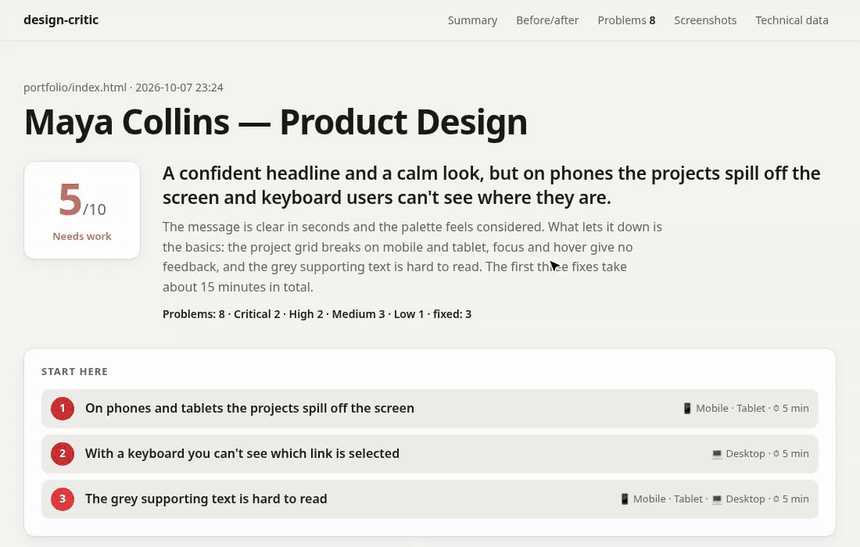
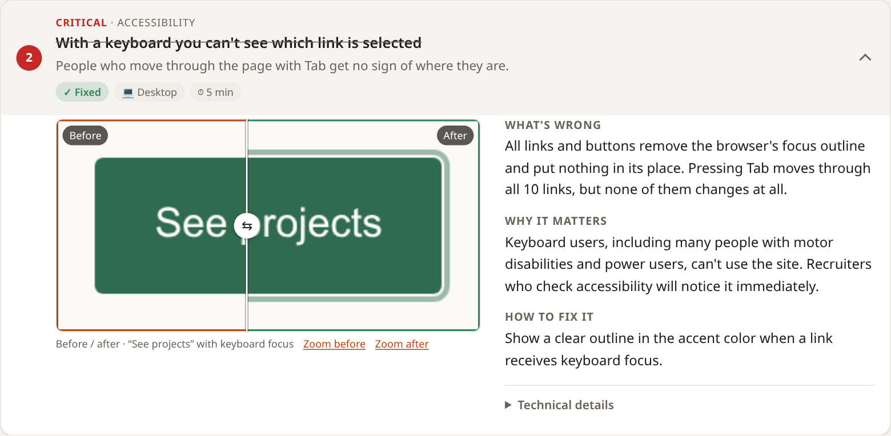

# design-critic

**A Claude Code skill that gives Claude eyes.** It opens your website in a real browser, screenshots it on mobile, tablet and desktop, measures what can be measured, looks at the result and hands you an honest, prioritized design critique, with the exact fix for every problem.

Claude writes a lot of CSS without ever seeing it render. design-critic closes the loop:

**capture → look → critique with evidence → fix → look again → prove nothing broke**



## What you get

- **A report anyone can read.** Score, one-sentence verdict and the 3 fixes with the most impact per effort at the top. Problems collapse to one line each; screenshots, plain-language explanations and copy-paste code are one click away.
- **Evidence, not opinions.** Every problem is boxed on a real screenshot. Contrast (WCAG), horizontal overflow, tap-target sizes, hover and keyboard-focus states, animations and `prefers-reduced-motion` are measured, not guessed.
- **Before/after verification.** After applying fixes, Claude recaptures the site and compares: ✓ better / = same / ✗ regression, pixel diffs and a drag slider on each fixed problem. It exits with an error if a fix broke something else, so regressions can't slip through.

  
- **Your language.** The critique is written in the language you speak to Claude, and the report interface comes in 16 languages: English, Spanish, French, German, Italian, Portuguese, Russian, Japanese, Korean, Hindi, Arabic, Bengali, Urdu, Indonesian, Turkish and Vietnamese (with right-to-left layout for Arabic and Urdu).
- **Spots "AI-made" design.** The purple gradients, gradient headlines, emoji icons, three identical feature cards and "Unlock the power of…" copy that make a site look like a thousand others, and what to do instead.

## How is this different?

There are other design-review skills. Most of them ask Claude to take screenshots and judge them by eye, or expect you to paste a screenshot yourself. design-critic adds what eyes alone can't give:

| | Typical design-review skill | design-critic |
|---|---|---|
| **Screenshots** | Taken by hand through a browser tool, or pasted by you | Scripted: 3 viewports × light/dark, page slices, hover/focus sheet, motion frames and video, in one command |
| **Contrast, overflow, tap targets, focus, motion** | Judged by eye, or checked with external tools | Measured on every element by a script, with exact numbers to quote |
| **After the fixes** | "Run it again" | Recaptures, compares metric by metric, shows pixel diffs and a before/after slider, and **fails if a fix broke something else** |
| **Report** | Markdown in the chat | A self-contained HTML report a client can read: plain language first, code and selectors one click away |
| **Language** | English | The critique in your language; report interface in 16 languages |

## Install

Requirements: [Claude Code](https://claude.com/claude-code), Python 3.9+ and Playwright.

```bash
pip install playwright && python3 -m playwright install chromium
```

Then, inside Claude Code:

```
/plugin marketplace add Fepe7/design-critic
/plugin install design-critic@design-critic
```

That's it. To update later: `/plugin marketplace update design-critic`.

<details>
<summary>Other ways to install</summary>

With the [skills](https://skills.sh) CLI (it can also install into other agents that read `SKILL.md` files):

```bash
npx skills add Fepe7/design-critic -g
```

Or as a plain skill folder:

```bash
git clone https://github.com/Fepe7/design-critic ~/.claude/skills/design-critic
```

Claude Code picks it up automatically; update with `git pull`.
</details>

## Use

Just ask, in any language:

- "What do you think of my site? It's running on localhost:4321"
- "Give me honest feedback on this landing page before I show it to the client"
- "Does my portfolio look OK on mobile?"

Or call it explicitly: `/design-critic https://example.com`

Claude captures the site, writes `.design-critic/<name>/report.html`, opens it and asks whether you want the fixes applied. It never touches your code without asking.

## How it works

| Script | What it does |
|---|---|
| `scripts/capture.py` | Screenshots (above the fold, slices, full page) per viewport and color scheme, hover/focus state sheet, motion frames and video, and `capture.json` with the metrics and already-interpreted alerts |
| `scripts/build_report.py` | Turns `capture.json` + the `findings.json` Claude writes into a self-contained HTML report |
| `scripts/compare.py` | Compares two captures, writes `comparison.json` and pixel diffs, exits with code 1 on any regression |
| `scripts/i18n.py` | Report interface strings; add a language by copying the `en` block |
| `references/criteria.md` | The critique rubric: concrete thresholds for hierarchy, typography, color, spacing, layout, states, motion, accessibility and AI-design tells |

The scripts work on their own too:

```bash
python3 scripts/capture.py https://example.com --out .design-critic/example
python3 scripts/compare.py .design-critic/example .design-critic/example-after
python3 scripts/build_report.py .design-critic/example --after .design-critic/example-after
```

## Try it on the included examples

`evals/fixtures/` contains two deliberately flawed sites: a landing page full of AI-design clichés and a portfolio that breaks on mobile. Point Claude at either one to see the full flow. `evals/evals.json` lists what a good critique of each should catch.

## Contributing

Translations are the easiest way to help: copy the `en` block in `scripts/i18n.py`, translate the values (keep the `{placeholders}`), and open a PR. Ideas for new checks and criteria are welcome too.

## Privacy

design-critic runs locally: no server, no account, no telemetry. Screenshots and reports stay in `.design-critic/` on your machine. See [PRIVACY.md](PRIVACY.md).

## License

MIT
